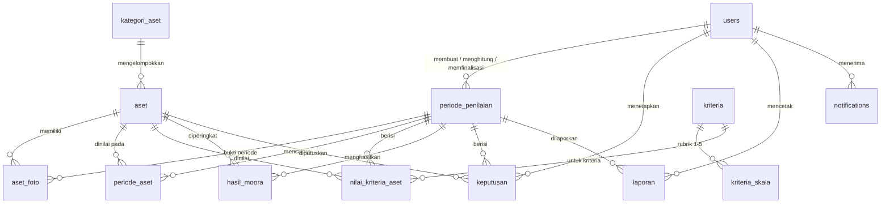

# 08 — Sinkronisasi Bab III (Analisa & Perancangan) dengan Sistem Akhir

> Disusun dari kode sistem akhir (branch `production-ready`, 4 Oktober 2026): skema dari migrasi, hak akses dari `routes/web.php`.
> Pakai dokumen ini untuk merevisi Bab III (use case, ERD, kamus data, matriks akses) dan bagian terkait Bab II,
> agar laporan sama persis dengan aplikasi yang diuji di Bab IV. Perbandingan dengan rancangan awal ada di `00-LAPORAN-MATCHING.md`.

## 1. Ringkasan perubahan terhadap rancangan awal Bab III

| Bagian Bab III | Rancangan awal | Sistem akhir |
|---|---|---|
| Aktor | 2 (Admin = Pengurus Barang, Pimpinan) | **3**: Admin (administrator sistem), Operator (Pengurus Barang), Pimpinan (Camat/Sekcam) |
| Use case | 9 | **31** (lihat §2) |
| Tabel | 7 | **16 tabel aplikasi** + tabel bawaan Laravel (sessions, cache, jobs) |
| Autentikasi | username + token | username/email + **session**, anti-bot Cloudflare Turnstile, wajib ganti kata sandi sementara, lupa kata sandi lewat email, logout otomatis saat tidak aktif |
| Antarmuka | Bootstrap 5 | Tailwind CSS + DaisyUI + Alpine.js (di-host sendiri, tanpa CDN), mobile-first |
| Server | Laragon/Apache | Nginx + PHP-FPM, MySQL 8 |
| Penilaian | nilai per aset | per **periode penilaian** (draft → dinilai → dihitung → final), rubrik skala 1–5 |
| Hasil | skor + ranking | Yi, **skor relatif 0–100**, ranking, rekomendasi, detail perhitungan (JSON) + snapshot bobot & ambang |
| Laporan | PDF | PDF (dengan **QR verifikasi keaslian**) & Excel, riwayat cetak |
| Pelengkap | — | Notifikasi (aplikasi, Telegram, email), audit log, cadangan otomatis, riwayat & perbandingan antar periode |

## 2. Aktor & use case (final)

**Admin** — mengelola akses & keamanan, tidak mengubah data penilaian (pemisahan tugas BMD).
**Operator (Pengurus Barang)** — mengelola data aset & kriteria, melakukan penilaian, menjalankan MOORA.
**Pimpinan** — meninjau peringkat, menetapkan tindakan, finalisasi.

| Kode | Use case | Admin | Operator | Pimpinan |
|---|---|:-:|:-:|:-:|
| UC-01 | Login (username/email + Turnstile) & logout | ✔ | ✔ | ✔ |
| UC-02 | Ganti kata sandi wajib saat login pertama / setelah reset | ✔ | ✔ | ✔ |
| UC-03 | Lupa kata sandi (tautan email) | ✔ | ✔ | ✔ |
| UC-04 | Kelola profil & hubungkan Telegram | ✔ | ✔ | ✔ |
| UC-05 | Melihat dashboard sesuai peran | ✔ | ✔ | ✔ |
| UC-06 | Melihat & membaca notifikasi | ✔ | ✔ | ✔ |
| UC-07 | Kelola pengguna (tambah, ubah, aktif/nonaktif, reset kata sandi) | ✔ | — | — |
| UC-08 | Kelola pengaturan (ambang rekomendasi, identitas laporan, logout otomatis, masa simpan cadangan) | ✔ | — | — |
| UC-09 | Kelola integrasi (Telegram Bot, SMTP) & uji kirim | ✔ | — | — |
| UC-10 | Kelola cadangan data (buat, unduh, hapus) | ✔ | — | — |
| UC-11 | Melihat audit log | ✔ | — | — |
| UC-12 | Melihat data aset & riwayat penilaian aset | ✔ | ✔ | ✔ |
| UC-13 | Tambah/ubah/hapus aset + foto | — | ✔ | — |
| UC-14 | Import data BMD dari Excel (template, pratinjau, konfirmasi) | — | ✔ | — |
| UC-15 | Export data aset ke Excel | — | ✔ | — |
| UC-16 | Kelola kategori aset | — | ✔ | — |
| UC-17 | Melihat kriteria | ✔ | ✔ | ✔ |
| UC-18 | Kelola kriteria, bobot & rubrik skala | — | ✔ | — |
| UC-19 | Membuat periode penilaian (cakupan aset) | — | ✔ | — |
| UC-20 | Ubah / hapus periode (Draft/Dinilai) | — | ✔ | — |
| UC-21 | Tambah / keluarkan aset dari periode berjalan | — | ✔ | — |
| UC-22 | Input nilai kriteria, kondisi & foto per aset | — | ✔ | — |
| UC-23 | Hitung MOORA | — | ✔ | — |
| UC-24 | Buka kembali periode final (dengan alasan) | — | ✔ | — |
| UC-25 | Melihat peringkat, detail aset & detail perhitungan MOORA | ✔ | ✔ | ✔ |
| UC-26 | Perbandingan antar periode | ✔ | ✔ | ✔ |
| UC-27 | Menetapkan keputusan tindakan per aset | — | — | ✔ |
| UC-28 | Finalisasi periode | — | — | ✔ |
| UC-29 | Membuat laporan PDF/Excel | — | ✔ | ✔ |
| UC-30 | Mengunduh laporan | ✔ | ✔ | ✔ |
| UC-31 | Verifikasi keaslian laporan (QR, tanpa login) | publik | publik | publik |

Proses otomatis sistem (bukan aktor manusia): kirim notifikasi (aplikasi/Telegram/email), cadangan harian 01.00, pencatatan audit.

## 3. Matriks hak akses per menu

| Menu | Admin | Operator | Pimpinan |
|---|---|---|---|
| Beranda | R | R | R |
| Data Aset | R | CRUD + import/export + foto | R |
| Kategori Aset | — | CRUD | — |
| Kriteria | R | CRUD | R |
| Periode Penilaian | R | C, U, D (Draft/Dinilai), kelola aset, input nilai, hitung, buka kembali | R |
| Hasil MOORA / Peringkat Aset | R | R | R |
| Perbandingan Periode | R | R | R |
| Keputusan | — | — | U + finalisasi |
| Laporan | R (unduh) | C + unduh | C + unduh |
| Pengguna | CRUD + status + reset | — | — |
| Pengaturan | U | — | — |
| Integrasi | U + uji | — | — |
| Cadangan | C, R (unduh), D | — | — |
| Audit Log | R | — | — |
| Profil, Notifikasi | R/U milik sendiri | R/U milik sendiri | R/U milik sendiri |

Ditegakkan oleh middleware `role:` di `routes/web.php`; diuji `RoleAccessTest`, `HardeningTest`, dan test per fitur.

## 4. ERD

Tabel tanpa relasi FK: `pengaturan` (key-value), `activity_log` (polimorfik subject/causer), `notifications` (polimorfik notifiable), `password_reset_tokens` (per email).

## 5. Kamus data (ringkas)

| Tabel | Kolom penting | Keterangan |
|---|---|---|
| `users` | name, username (unik), email?, telegram_chat_id?, password (hash), role, is_active, must_change_password, nip?, jabatan? | role: admin/operator/pimpinan |
| `kategori_aset` | kode, nama | 6 kategori BMD |
| `aset` | kategori_aset_id, kode_barang, nup, nama_barang, jumlah, luas?, tanggal_perolehan, harga_satuan, nilai_perolehan, umur_ekonomis, akumulasi_penyusutan, sisa_ueb, nilai_buku, lokasi?, status, deleted_at? | 11 kolom BMD; unik (kode_barang, nup); soft delete |
| `aset_foto` | aset_id, periode_id?, path, keterangan? | foto bukti periode final tidak dapat dihapus |
| `kriteria` | kode, nama, tipe (benefit/cost), bobot, skala_min, skala_maks, urutan, is_active, keterangan? | total bobot aktif = 100% |
| `kriteria_skala` | kriteria_id, nilai, label, deskripsi? | rubrik penilaian |
| `periode_penilaian` | nama, tanggal_mulai, tanggal_selesai?, status, snapshot_kriteria (JSON), snapshot_ambang (JSON), dihitung_pada/oleh, difinalisasi_pada/oleh, alasan_buka_kembali?, created_by | status: draft/dinilai/dihitung/final |
| `periode_aset` | periode_id, aset_id, deskripsi_kondisi? | aset yang dinilai pada periode |
| `nilai_kriteria_aset` | periode_id, aset_id, kriteria_id, nilai | unik (periode, aset, kriteria) |
| `hasil_moora` | periode_id, aset_id, yi, skor_relatif, ranking, rekomendasi, detail (JSON) | unik (periode, aset) |
| `keputusan` | periode_id, aset_id, user_id, tindakan, rekomendasi_sistem, catatan? | catatan wajib bila berbeda dari rekomendasi |
| `laporan` | user_id, periode_id?, jenis, format, nama_file, path, kode_verifikasi?, sha256? | QR verifikasi + sidik jari berkas |
| `pengaturan` | key, value | ambang, identitas laporan, logout otomatis, masa simpan cadangan, integrasi (rahasia terenkripsi) |
| `notifications` | notifiable, data (judul, pesan, url, ikon, tone), read_at | notifikasi dalam aplikasi |
| `activity_log` | log_name (modul), description, subject, causer, properties (lama/baru) | audit log |
| `password_reset_tokens` | email, token, created_at | lupa kata sandi (60 menit) |

## 6. Revisi teks laporan yang disarankan

- **Bab II (Landasan Teori / Tools):** Tailwind CSS, DaisyUI, Alpine.js (bukan Bootstrap 5); Nginx + PHP-FPM (bukan Laragon/Apache untuk produksi); tambahkan Telegram Bot API (notifikasi), Cloudflare Turnstile (anti-bot), QR Code (verifikasi dokumen).
- **Bab III 3.1 (Analisa sistem berjalan/usulan):** sebutkan periode penilaian sebagai jawaban atas masalah "hasil tidak dapat ditelusuri antar waktu", serta perbandingan antar periode untuk melihat tren.
- **Bab III use case & skenario:** ganti diagram 2 aktor/9 use case dengan §2; tambahkan skenario wajib ganti kata sandi, lupa kata sandi, hubungkan Telegram, verifikasi QR.
- **Bab III activity/sequence:** Login (session + Turnstile + cek akun aktif + wajib ganti sandi); Kelola Kriteria (total bobot 100% divalidasi saat Hitung MOORA); Hitung MOORA → notifikasi Pimpinan; Finalisasi → status aset diperbarui + notifikasi Operator/Admin.
- **Bab III ERD & kamus data:** ganti dengan §4–§5.
- **Bab III rancangan antarmuka:** tangkapan layar ponsel (390 px) & desktop (1440 px), termasuk panduan singkat per halaman dan tombol "Perbesar teks".
- **Bab IV pengujian:** kasus uji black-box ada di `06-PENGUJIAN-BAB-IV.md`; tambahkan kasus fitur production-ready (lihat checklist di `PROGRESS.md`, setiap butir memiliki test otomatis).
